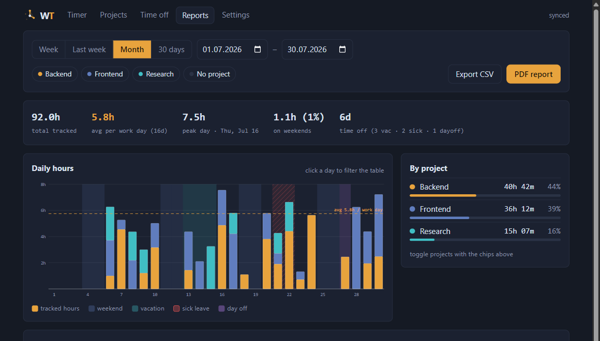
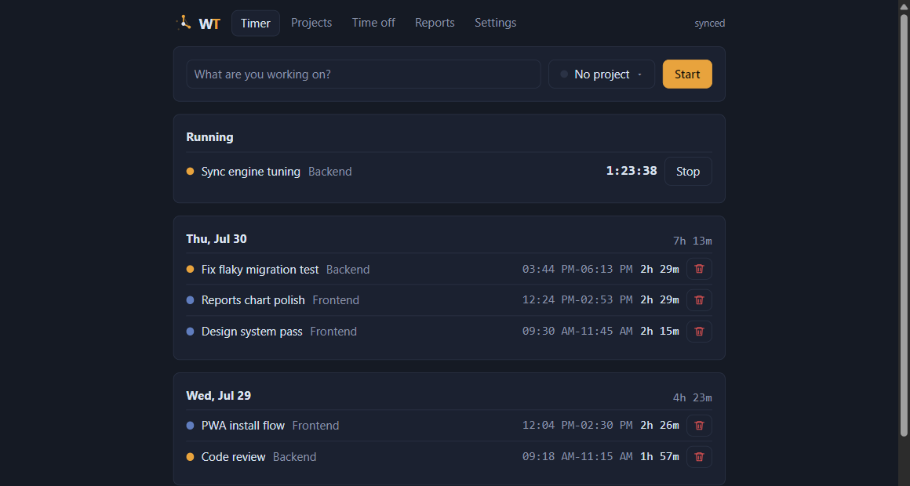

<p align="center">
  
</p>

<h1 align="center">WorkTime</h1>

<p align="center">
  Free, open-source, self-hosted time tracker.<br />
  <sub>Single binary · local-first PWA · MCP server for AI agents</sub>
</p>

<p align="center">
  
  
  
  
  
  
</p>



## Why WorkTime

- **Single binary** - Go backend with the web UI embedded. Download, run, open `localhost:8080`. SQLite storage, no external services.
- **Local-first PWA** - works fully offline: timers keep running without a network connection and sync when it returns. Install it on your phone from the browser, no native app needed.
- **Multiple concurrent timers** - track parallel work honestly; running timers are data, not a UI hack.
- **Time off as data** - vacation, sick leave and days off are first-class: shown in charts, counted in averages, never blocking tracking.
- **Reports that answer questions** - interactive daily chart, custom report builder (group by, columns, rounding), CSV export and a printable PDF report.
- **MCP server** - AI agents start/stop timers, log time off and query reports via Model Context Protocol.
- **Multi-user** - Google sign-in, per-user data isolation. No billing, no clients, no seat pricing. Free forever.
- **Six UI languages** - English, Russian, Spanish, German, French, Chinese; light and dark theme; 12/24h and date format preferences.
- **Tiny footprint** - ~16MB RSS on the server, ~25KB gzip frontend bundle, 11MB binary.



## Status

Early development. Core works (timers, projects, time off, sync, reports, MCP); expect rough edges.

## Self-hosting

### Binary

```sh
make build          # produces bin/worktime with the web UI embedded
WORKTIME_GOOGLE_CLIENT_ID=... WORKTIME_GOOGLE_CLIENT_SECRET=... ./bin/worktime
```

### Docker

```sh
docker build -t worktime .
docker run -d -p 8080:8080 -v worktime-data:/data \
  -e WORKTIME_BASE_URL=https://time.example.com \
  -e WORKTIME_GOOGLE_CLIENT_ID=... \
  -e WORKTIME_GOOGLE_CLIENT_SECRET=... \
  -e WORKTIME_ALLOWED_EMAILS=you@example.com,team@example.com \
  worktime
```

### Configuration

| Env var | Default | Purpose |
|---|---|---|
| `WORKTIME_ADDR` | `:8080` | Listen address |
| `WORKTIME_DB` | `worktime.db` | SQLite database path |
| `WORKTIME_BASE_URL` | `http://localhost:8080` | External URL, used for OAuth redirects and secure cookies |
| `WORKTIME_GOOGLE_CLIENT_ID` / `WORKTIME_GOOGLE_CLIENT_SECRET` | - | Google OAuth Web credentials; redirect URI is `$BASE_URL/auth/google/callback` |
| `WORKTIME_ALLOWED_EMAILS` | empty = everyone | Comma-separated allowlist of Google accounts |
| `WORKTIME_DEV_AUTH` | off | `1` auto-signs every request in as a local dev user. Never use in production |

Backup = copy the SQLite file (or the `/data` volume).

### MCP

Create an API token in Settings, then connect any MCP client to `https://your-host/mcp` with header `Authorization: Bearer <token>` (streamable HTTP transport).

```sh
claude mcp add --transport http worktime https://your-host/mcp --header "Authorization: Bearer <token>"
```

Tools: `start_timer`, `stop_timer`, `stop_all_timers`, `list_running_timers`, `add_time_entry`, `list_projects`, `create_project`, `add_time_off`, `list_time_off`, `time_report`.

## Development

```sh
make dev-api   # run Go backend on :8080 (use WORKTIME_DEV_AUTH=1 to skip Google sign-in)
make dev-web   # run Vite dev server (proxies /api to :8080)
make build     # build web + single binary
make test      # run tests
make e2e       # build, then run the Playwright suite against the binary
```

## License

MIT
